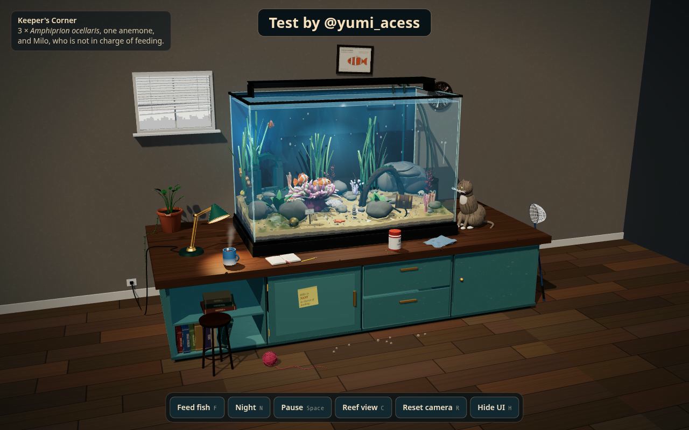
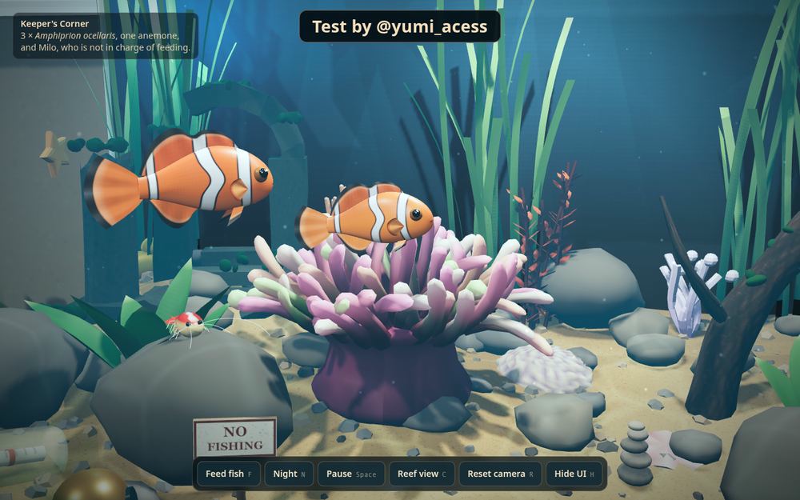
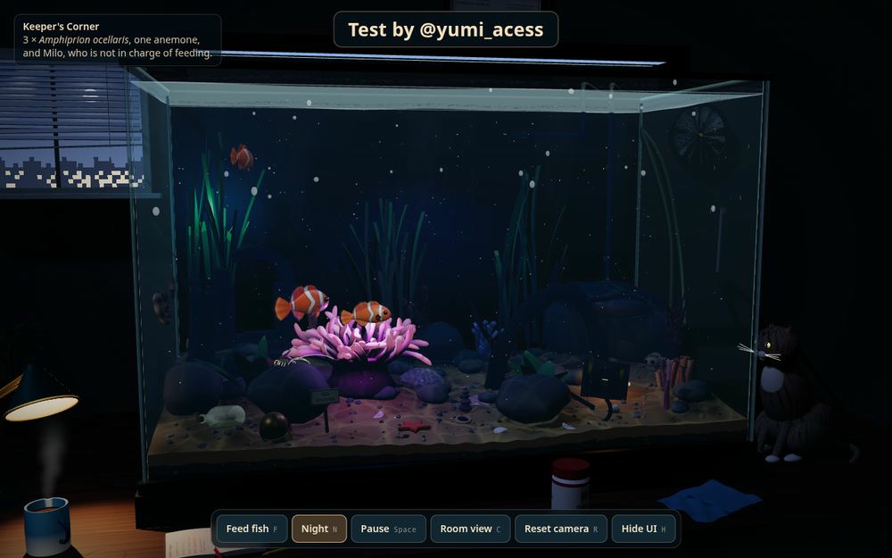

# 🐠 Keeper's Corner: Interactive 3D Aquarium

**Test by @yumi_acess**

An interactive 3D reef aquarium in a lived-in keeper's corner: three clownfish (*Amphiprion ocellaris*) and their anemone, driftwood, temple ruins, a treasure chest, a snail, a cleaner shrimp and a tiny crab, bubbles, plankton and caustics, day/night lighting, a cozy room with a desk, and Milo the cat, who is not in charge of feeding.

The whole scene is one self-contained `index.html` built on three.js r160. There's nothing to install and no assets to download.

**▶ Live demo:** https://helpfulbriefl.github.io/keepers-corner-aquarium/

> 🇷🇺 **Кратко.** Интерактивный 3D-аквариум в одном HTML-файле (three.js r160). Открой `index.html` в браузере. Нужен интернет, потому что three.js загружается с CDN. В папке `prompt/` лежит улучшенный промт v2, по которому можно сгенерировать такую сцену в любой LLM.



| Clownfish close-up | Night mode |
|:---:|:---:|
|  |  |

## Controls

| Action | Mouse / touch | Key |
|---|---|---|
| Orbit and zoom | drag, scroll or pinch | |
| Feed the fish | double-click the water or click the food jar | `F` |
| Day / night | click the desk lamp | `N` |
| Pause | | `Space` |
| Room view / reef view | | `C` |
| Reset camera | | `R` |
| Hide / show UI | | `H` |

You can also click the glass to tap it (the fish dart away), the treasure chest, the rubber duck, the door, the notebook and Milo.

## Run locally

Open `index.html` in a modern browser (Chrome, Edge, Firefox or Safari). The first load needs an internet connection because three.js comes from the unpkg CDN.

If your browser blocks modules on `file://`, serve the folder instead:

```bash
python3 -m http.server 8000
# then open http://localhost:8000
```

## Repository layout

| Path | Contents |
|---|---|
| `index.html` | The finished scene in a single file |
| `src/` | The same code split into readable parts (`head.html`, `00_core.js` to `14_loop.js`) |
| `build.mjs` | Rebuilds `index.html` from `src/`: `node build.mjs index.html -` |
| `prompt/aquarium-prompt-v2.md` | The improved generation prompt (English) |
| `shots/` | Screenshots |

## Prompt v2: what changed

- **Read This First and Build Order.** Hard rules come first, then priority tiers P0, P1 and P2, so the model ships a working scene before it adds polish.
- **Mandatory author credit.** The ad banner is replaced by a readable "Test by @yumi_acess" credit with an explicit pass/fail check.
- **Glass without `transmission`.** In three.js, transmissive glass hides the transparent objects behind it, so the fish and the water can vanish. The panels now use plain transparent materials.
- **Clownfish construction.** Each fish has one continuous body and flat fins, with stripes drawn in the shader. Tube-built fish are forbidden. Swimming runs in the vertex shader.
- **Motion math, light units and r160 API notes.** These prevent jitter, fish stuck in corners, invisible fish, wrong light intensities and common version mistakes.
- **Acceptance criteria.** An anti-breakage checklist the model has to pass before it answers.

References: [three.js transmission issue](https://discourse.threejs.org/t/objects-with-transmission-not-showing-objects-behind/47113) · [LLM aquarium benchmark](https://github.com/nikosleft/aquarium-llm-benchmark) · [Godot: animating thousands of fish](https://docs.godotengine.org/en/3.4/tutorials/performance/vertex_animation/animating_thousands_of_fish.html) · [Impossible Fishbowl](https://github.com/ir272/fishbowl) · [caustic-volume](https://github.com/ScottieFox/caustic-volume) · [USGS: clown anemonefish](https://nas.er.usgs.gov/queries/FactSheet.aspx?speciesID=3243)

## Credits

Test by @yumi_acess. Built with [three.js](https://threejs.org) (MIT).
